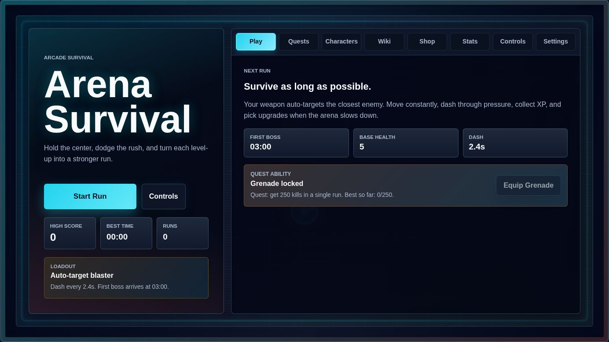

<div align="center">
  <h1>Arena Survival</h1>
  <p><strong>A fast arcade survival game that runs directly in the browser.</strong></p>
  <p>
    Dodge the rush, collect XP, pick upgrades, unlock loadouts, and survive the boss waves.
  </p>
  <p>
    <a href="#play-locally">Play locally</a> |
    <a href="#online-leaderboard">Online leaderboard</a> |
    <a href="#controls">Controls</a> |
    <a href="#self-test">Self-test</a>
  </p>
</div>



## Game

Arena Survival is a static browser arcade game built around short survival runs. Your weapon auto-targets the closest enemy, so the run is about movement, dash timing, upgrade choices, and knowing when to hold space or give ground.

## Features

- Arcade hub main menu with records, next-run details, quests, characters, shop, stats, controls, settings, and an in-game wiki.
- Auto-target combat with enemies, XP pickups, level-up upgrade choices, and boss waves.
- Unlockable character and ability goals, including grenade, katana, and Engineer turret progress.
- Expanded enemy roster with shooters, acid spitters, tanks, chargers, boss sentinels, and projectile-heavy bosses.
- Local browser saves for progress, records, gold, unlocks, stats, and audio preferences.
- Optional online leaderboard API, with the static frontend still playable when the backend is offline.
- Static frontend setup: no build step and no required install.
- Built-in browser self-test for core gameplay and save behavior.

## Controls

| Action | Keyboard |
| --- | --- |
| Move | `WASD` or arrow keys |
| Dash | `Space` |
| Engineer turret | `T` |
| Pick upgrades | Number keys or click |
| Pause / return flow | On-screen buttons |
| Audio | Sound buttons in the top bar or settings |

## Play Locally

Open `index.html` directly in a browser, or serve the frontend locally:

```sh
python3 -m http.server 8000 --bind 127.0.0.1
```

Then open:

```text
http://127.0.0.1:8000/
```

## Online Leaderboard

The leaderboard backend is optional. The frontend uses the placeholder URL in `src/online.js` by default, so hosted static builds keep working until a real API URL is configured.

Run the local backend:

```sh
cd server
npm install
npm start
```

The local API runs on:

```text
http://127.0.0.1:8787/
```

To test the frontend against the local API, temporarily set `LEADERBOARD_API_BASE_URL` in `src/online.js` to `http://127.0.0.1:8787`.

Useful checks:

```sh
curl -fsS http://127.0.0.1:8787/health
curl -fsS http://127.0.0.1:8787/leaderboard
```

Deploy on Render:

- Create a Render Web Service from this GitHub repo.
- Set the root directory to `server`.
- Use build command `npm install`.
- Use start command `npm start`.
- Render provides `PORT`; the server defaults to `8787` locally.
- Replace `LEADERBOARD_API_BASE_URL` in `src/online.js` with the Render app URL.

The leaderboard is stored in memory only and resets whenever the backend restarts.

## Self-Test

The game includes a browser self-test:

```text
http://127.0.0.1:8000/?selfTest=1
```

The self-test checks gameplay startup, upgrades, character selection, admin unlocks, quit-to-title progress saving, and storage behavior.

## Project Structure

```text
.
|-- index.html
|-- styles.css
|-- src/
|   |-- game.js
|   |-- main.js
|   |-- online.js
|   |-- storage.js
|   |-- audio.js
|   |-- bundle.js
|   `-- data/
|-- server/
|-- sounds/
`-- docs/
```

`index.html` loads `src/bundle.js`, so source edits should keep the generated bundle in sync.
